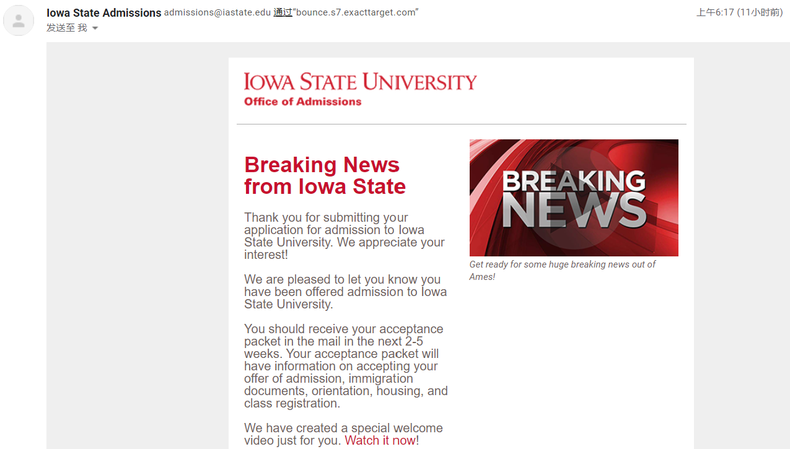

## 前言

本来准备六月月底发月记，但是下旬时候给准备 Transfer，心情比较复杂，等通知下来再说剩下事情。

## 转学

前言：[《最近很少写博客了》](https://www.himself65.com/2020-2-recently/)

申请准备交上去时候十分自闭，自己 `GPA`、英语都一般般，感觉要凉了。然后群友让我在 Activities 里面加上 `GitHub` 账号，不知道是不是这个原因的关系，总之今天终于通过了。

然后就是等录取信，然后填信息了。

## [BREAD-OS](https://github.com/Himself65/bread-os)

中文面包OS，本来就是读了读《CSAPP》、《汇编语言：从实模式到保护模式》、《UNIX操作系统设计》，然后看到迟先生写的 [core-os-riscv](https://github.com/skyzh/core-os-riscv) 太强了，于是准备自己糊一个OS玩玩。

实际操作下来，光是工具链就可以学一通：Makefile、CMake、LinkScript……就可以鼓捣一番，实际上光编译脚本就写了一个礼拜……

当然博客里已经开了专栏，时不时写点OS开发相关文章。

## 日常

还是和上个月差不多，写写代码，因为写OS，显著提升了 `C++` 水平……其次买了一堆书，目测有十本以上，六七本都是操作系统相关的，目前才简略看了两三本，等我看的有点头绪了再写点什么。
