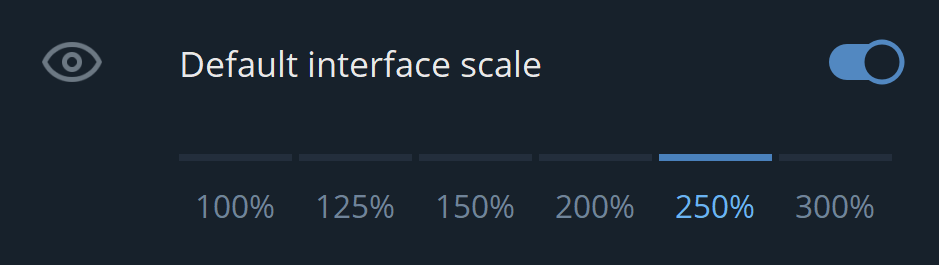

肝了几天 `赛博朋克2077`，随后而来的是一阵索然无味。碰巧最近新的显示屏到了，发现 Telegram PC客户端没法自适应DPI，实在忍不了。

于是尝试编译这个玩意，看看能不能改改，本来觉得也就一会儿的事情，发现这东西比 `Node.js` 和 `V8` 还要难编译。顺便写点东西留给后人。（希望到时候 `赛博朋客2077` 修复了大部分bug）

本系列一直写到修复[这个bug](https://github.com/telegramdesktop/tdesktop/issues/1121)为止，顺便为读者理清 `TDesktop` 的项目结构。

## 开始编译

读[官方的编译文档](https://github.com/telegramdesktop/tdesktop/blob/dev/docs/building-msvc.md)，一步一步操作即可。

它把整个项目分成了三个部分

- Libraries: 第三方库，不过是供 `tdesktop` 静态链接用的。TG用的很多功能都是调用了这里面的库。
- tdesktop: 项目本体
- ThirdParty: 第三方库，提供编译环境。
    **`Ninja`** 是为 `Google` 项目编译；**`Perl`**、**`Git`** 用来下载项目；**`Python2.7`** 运行整个项目的构建脚本；**`CMake`**、**`jom`** 属于各种各样的 `make`；**`nasm`**、**`yasm`** 是两个不同的汇编语言编译器；**`msys2`** 提供 `mingw` 和 `类Linux` 的环境。

### 安装第三方软件

这些软件，虽然官方告诉你让你一股脑放到 `BuildPath\ThirdParty` 里面。但是你如果去官网下载了 `.msi` 文件，那么很可能变成加到全局环境变量里，建议下载 `.zip` 文件然后拷进去，防止污染全局环境。

### 编译第三方库

直接一步一步按照官方文档给的脚本就可以编译完成。值得注意的是在编译 `ffmpeg` 和 `qt_5_15_2` 的时候容易挂，多用 `Google` 搜一下就出来了。

## 其他事项

- `Python3` 一定要删掉，不然会和 `Python2.7` 冲突，即使从环境变量里删掉Python3也一样。否则产生一些符号表找不到的问题。目测是 `cmake` 会通过通用路径来查找 `Python`

- 如果打开 `TBuild\tdesktop\out\Telegram.sln` 后发现一些不可思议的错误，建议把 `out` 文件夹删除并重新编译项目

- `E0018 expected a ')'`，估计是bug，无视即可。不影响编译

- `C4819`: 用其他编码保存即可（我用的 Unicode - Codepage 1200）

- `C2220`: 根据[这个文档](https://docs.microsoft.com/en-us/cpp/error-messages/compiler-errors-1/compiler-error-c2220?f1url=%3FappId%3DDev16IDEF1%26l%3DEN-US%26k%3Dk(C2220)%26rd%3Dtrue&view=msvc-160)，调低警告等级或者关闭“将警告视为错误”

### 为什么要静态编译？

根据[官方的说法](https://github.com/telegramdesktop/tdesktop/issues/4688)，为了让用户下载了就可以直接用。而且不支持动态链接。

## 其它系统

不管是 `Linux`、还是 `macOS`，第三方库编译都是一模一样，`Telegram` 这一点倒是做的好，个人看了看是 `cmake` 构建的整个项目。

## 参考

<https://blog.csdn.net/lanchunhui/article/details/51192169>

<https://zhuanlan.zhihu.com/p/42242300>

<https://zhuanlan.zhihu.com/p/268811936>
