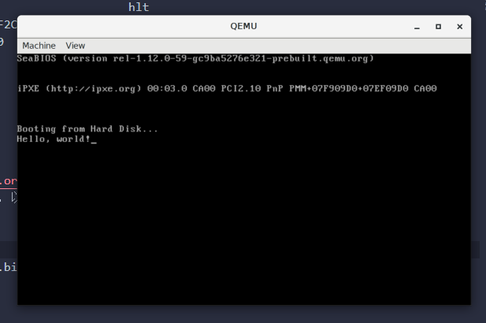

## 前言

本系列介绍了写操作系统（x86_64架构）的大致过程和思路，和相关开发工具链的使用，最后会引入 `Linux Kernel` 设计。

想要深入学习请访问最下方列出的**推荐阅读及参考链接**。

## 什么是X86

1978年6月，Intel推出了8086芯片，其是一款16位的处理器，可以寻址 `1MB` 的地址空间（2^20 = 1,048,576）。其需要调整段寄存器才能操作全部的地址空间。

```asm6502
mov ax, 0xB800
mov es, ax      ; 调整段寄存器

mov byte[es:0x00], 'L'
```

直到后来的80386芯片，其可以操作32位的地址空间（所以被称为32位处理器），但是因为旧款芯片十分成功，所以为了兼容16位，所以区分出了 `实模式` 和 `保护模式`（从80286芯片开始），我们会在随后章节中介绍其不同。

## 从实模式开始

因为历史原因（为了兼容旧程序），`x86` 处理器需要从16位开始运行，读取磁盘第一段程序。然后从 `0x7c00` 地址开始运行（[为什么从 `0x7c00` 开始？](http://www.ruanyifeng.com/blog/2015/09/0x7c00.html)）

从一段 `Hello, world` 开始

```asm6502
bits 16     ; 16位编译
org 0x7c00  ; 从0x7c00是起始地址
boot:
    mov si, hello   ; hello的地址传给si寄存器（Source Index Register）
    mov ah, 0x0e    ;
.loop:
    lodsb           ; 加载地址 ds:si 到 al，这里ds寄存器是0x0000
    or al, al       ; 判断 al == 0 ?
    jz halt         ; 如果是，跳到 halt
    int 0x10        ; BIOS软中断 0x10
    jmp .loop       ; 跳回 .loop
halt:
    cli             ; 清除中断标志
    hlt             ; 停止CPU
hello: db "Hello, world!", 0

times 510 - ($ - $$) db 0   ; 510 比特 减去（当前行减去起始地址）个 0
dw 0xAA55   ; Magic Number  ; 最后 2比特 表示此引导扇区正确
```

前面提到过，实模式的地址加载模式是 `es:0x0000`，随后es寄存器左移四位然后加上随后的地址，然后可以寻址完整的20位地址空间

`ax` 的前八位和后八位分别是 `ah` 和 `al`

```bash
nasm source.asm -f elf32 -o output.bin -l output.lst
```

生成 `.lst` 文件，能让我们清楚的看到源代码和编译后的结果。

最左面是源代码的行数，随后是地址、二进制码、源代码内容。

```text
     1                                  bits 16
     2                                  org 0x7c00
     3                                  boot:
     4 00000000 BE[1000]                    mov si, hello
     5 00000003 B40E                        mov ah, 0x0e
     6                                  .loop:
     7 00000005 AC                          lodsb
     8 00000006 08C0                        or al, al
     9 00000008 7404                        jz halt
    10 0000000A CD10                        int 0x10
    11 0000000C EBF7                        jmp .loop
    12                                  halt:
    13 0000000E FA                          cli
    14 0000000F F4                          hlt
    15 00000010 48656C6C6F2C20776F-     hello: db "Hello, world!", 0
    15 00000019 726C642100
    16
    17 0000001E 00<rept>                times 510 - ($ - $$) db 0
    18 000001FE 55AA                    dw 0xAA55
```

### QEMU

[`QEMU`](https://www.qemu.org/) 是一个把 硬件环境模拟到软件 的软件，所以我们可以方便的模拟其他的系统（Windows、Linux、OS X），或者是我们写的系统

```bash
# 运行我们写好的代码
qemu-system-x86_64 output.bin
```



## 推荐阅读及参考链接

[保护模式 —— Wikipedia](https://zh.wikipedia.org/wiki/%E4%BF%9D%E8%AD%B7%E6%A8%A1%E5%BC%8F)

[寄存器](https://www.tutorialspoint.com/assembly_programming/assembly_registers.htm)：介绍32位和16位下各寄存器功能

[OS-dev](https://wiki.osdev.org/Expanded_Main_Page)：如果你英文够好，此网站有一条龙的操作系统从入门到精通指南

[x86汇编语言：从实模式到保护模式](https://book.douban.com/subject/20492528/): 从汇编语言介绍了x86下的操作系统编写
