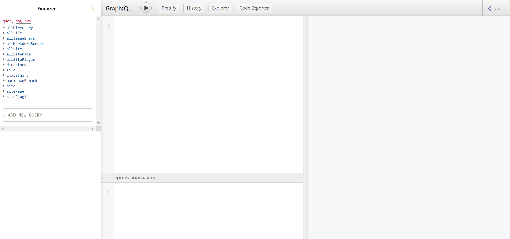

`Gatsby` is a site generator for React. I tried to use `Vuepress` coding myself blog previously, but I don't like `Vue2.x` firstly (for its badly `typescript` support), then `Vuepress` have not much communityEcosphere support like plugins or tutorials.

So I use `Gatsby` to generate myself blog, and I find It uses `GraphQL` proceeding Server Side Render(SSR). But The web is **static**, so we could only use the static method.

Programming on the export module, then we can receive the response from the `props`.

Or use the `StaticQuery` component, `useStaticQuery` hook. You can find the guideline on [GraphQL & Gatsby](https://www.gatsbyjs.org/docs/graphql/).

And testing GraphQL code on `localhost:8000/___graphql`



## Fetching the Images

Yesterday, I was coding the component which displays my friend with name, his/her avatar, blog link.

on configuration

```js
const friendship = []
const push = (name, url, image = '', description = '') =>
  friendship.push({ name, url, image, description })

push('ice1000', 'https://ice1000.org', 'ice1000.jpg')
push('Edward Elric', 'https://sasuke40.github.io/', 'sasuke.jpg')
push('DIYgod', 'https://diygod.me/', 'DIYgod.jpg')
push('太狼', 'https://lynvv.xyz', 'lynvv.jpg')
push('木子', 'https://blog.502.li', 'muzi502.png')

module.exports = friendship
```

```js
const friendship = require('./friendship')

module.exports = {
  siteMetadata: {
    // ...
    friendship: [...friendship]
  }
}
```

on '/friend' page component

```js
const FriendPage = (props) => {
  const { data } = props
  const siteTitle = data.site.siteMetadata.title
  return (
    <Layout location={props.location} title={siteTitle}>
      <SEO title='Friends'/>
      <RouterTabs
        routers={data.site.siteMetadata.menuLinks}
        currentPage='/friends'
      />
      <ul className='friends'>
        {data.site.siteMetadata.friendship.map(friend => {
          // ???
        })}
      </ul>
    </Layout>
  )
}
```

Then I find that we cannot query Image by variables like this:

```js
const ImageRender = ({ url }) => {
  return (
    <div>
      <StaticQuery query={graphql`
        query {
          image($src: String = "${url}") {
            src
          }
        }
      `} render={data => {
        return (
          <Image src={data.image.src}/>
        )
      }}/>
    </div>
  )
}
```

Through my Google and looking up Gatsby repo's issue, some other people faced the same problem too.

https://spectrum.chat/gatsby-js/general/using-variables-in-a-staticquery~abee4d1d-6bc4-4202-afb2-38326d91bd05

https://github.com/gatsbyjs/gatsby/issues/10482

We have to find another way to achieve our aim. One solution I found is to fetch all data and filter them on rendering. Because of SSR, we don't need to worried about the performance loss.

```js
export const pageQuery = graphql`
    query {
        avatars: allFile {
            edges {
                node {
                    relativePath
                    name
                    childImageSharp {
                        fluid(maxWidth: 100) {
                            ...GatsbyImageSharpFluid
                        }
                    }
                }
            }
        }
    }
`
```

and filter them

```js
const { data } = props
const siteTitle = data.site.siteMetadata.title

const avatars = data.avatars.edges
  .filter(avatar => /^friend/.test(avatar.node.relativePath))
  .map(avatar => avatar.node)
```

on component

```js
{data.site.siteMetadata.friendship.map(friend => {
    // filter
    const image = avatars
      .find(v => new RegExp(friend.image).test(v.relativePath))
    return (
    <li key={friend.name}>
        <Image
          fluid={image.childImageSharp.fluid}
        />
        <span>{friend.name}</span>
    </li>
    )
})}
```

You can find all details [here](https://github.com/Himself65/himself65.github.io/blob/master/src/pages/friends.js)
