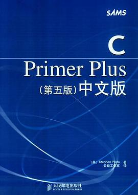
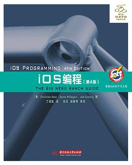
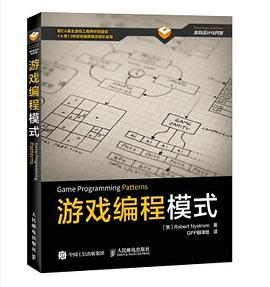
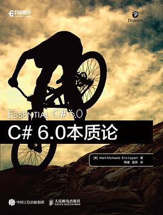

编程的启蒙书刊，可能不是什么 `C/C++` 系书刊，而是我小学时候订的《少年电脑杂志》附带的那本黑白的小册子（大虾试炼场）。
其中绝大部分的内容我现在没有任何印象，唯一记得清楚的就是因为平常住的姥姥家没有网，于是放假回我家的时候把w3chool的HTML所有元素打印了下来，
然后看了几个礼拜。

之后再接触编程，是初二到初三时候，买了几本书看，不幸的是，一开始买的是谭浩强的《C程序设计》，先不论这本书有多少喷点，
至少他没有教你“如何安装C语言”，导致我不知道怎么运行一遍他说的代码。导致我很久都以为自己智商不足无法学习编程，直到几个月后，
买了一本《C Primer Plus 5th》（当时中文还是第五版最新），里面明明确确说了，可以用IDE跑代码。于是在我的MacBook Air上下载了XCode，
终于开始了编程。

之后开始学习 `iOS` 编程，起因是喜欢的人买了一台iPhone，想给她写一个App，于是买了很多书看，
比如C语言经典系列：《C和指针》、《C陷阱与缺陷》、《C专家编程》、《Objective-C编程：Big Nerd Ranch入门经典》
看了不少人写的答案，
比如 [钟颖Cyan](https://github.com/cyanzhong) 写的有关 `Objective-C` 的知乎答案，我当初注册 GitHub 第一个关注的也就是他、再或者 [轮子哥](https://github.com/vczh) 知乎早期除了喜欢带逛也喜欢教人，所以我早期的时候就想成为轮子哥一样“软硬通吃”的人士（逃

不幸的是，MacBook Air 编译 `iOS App` 太卡了，那时候 `Kotlin` 还不是谷歌官推语言。
闲地没事的我又开始学 `C#`，开始写 `Unity2D`（不写3D的是因为太卡了），那时候大概深入理解OOP，
事件驱动这些大而虚的概念，这时候买的书越来越多，比如《游戏开发模式》、《C#本质论》。

高一暑假的时候我又花了几个礼拜，写了一个UWP应用 —— [At Before](https://github.com/Himself65/At-Before)，这个App还一直在我的Github上。

如果完成了将会是很管用的App，可惜当时没理解VS里多解决方案怎么处理，
导致写后台服务的时候不会导入，然后写到里面这个程度就鸽了。

同时期，我还参加了学校的机器人比赛，写了一个C语言控制车子沿着黑线跑的程序 —— [Robot](https://github.com/Himself65/Robot)，最后去太原比赛的时候可惜我太自以为是了，写三光探测器实现的小车程序没有调好参数，拿了个二等奖。
后来得知带我们的老师每届都是一等奖，搞得我那时一直有点对不起他。

之后老师告诉我有程序设计比赛，我还学了一下Swift，写了个 [Go Study](https://github.com/Himself65/Go-Study)。大概就是个一个新建事项，然后加到列表里面。
现在看起来非常简单的代码我做了有半个月。

很不幸的一件事，我很晚才知道 `NOIP`，当我高二知道的时候报名已经截止了，只能高三参加，刷题的时候去了 [洛谷](https://www.luogu.com.cn/)。当时正好在招开发，第一次面试没过。于是狠下心来学了一个月 `Vue2.x`，最后 `lin_toto` 看我奋发图强就把我招了进去，进去做了半年切图仔，最后看不下去我太菜了于是十一月把我踢了。
不过学 `Vue.js` 的时候研究了一遍 `webpack`、`rollup` 之类的工具链，最后发现了 `node.js`，慢慢的发现大项目也有错误，于是开始试着提交PR代码，开始混开源社区。期间认识了小爝，帮他的 `daruk.js` 稍微写写什么的。

一直到现在，其实什么都有涉猎，`Android App`、`x86汇编`、`Rust`……
我觉得做什么都有种得心应手的感觉。主要还是因为代码敲的多，当然指的不是数量上的多，
而是广度上的多。其次是因为早年一直都可以写代码，这得感谢我妈一直没反对我写代码，
和我说学一门“手艺”别饿死才是最根本的，虽然听起来很low，
但是我发现等到快饿死的时候才学手艺的人才是最惨的（逃

## 后言

本来这篇文章是想帮朋友写“如何入门编程”之类的内容，
但是我觉得有必要先写一下我学编程，下一篇再写如何入门编程。
