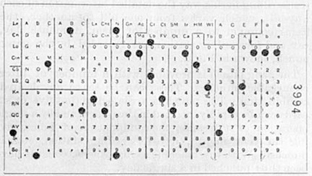
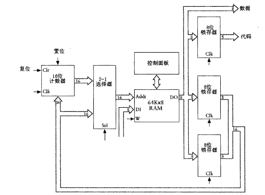

前不久，我妈突然给我打电话，十分着急，因为一个Excel问题犯了难，她要从两个表格（Sheet）中删除不重复的姓名的行。

比如

表格一

姓名 | A | B
--|:--:|--:
张三 | f | c
李四 | x | b
王五 | g | v

表格二

姓名 | C | D
--|:--:|--:
赵一 | c | h
李四 | s | v
王五 | g | v

最后表格一的结果应该是：

姓名 | A | B
--|:--:|--:
李四 | x | b
王五 | g | v

当然，我很快就解决了问题，但我想到了更多的事情。

## “计算机”科学

一提到计算机科学，就想到算法、数据结构，这些最基础的东西。
为此，我十分赞同MIT SICP课一开始老师所说：“计算机科学是个很糟糕的名字。
首先，它不算一门科学，它更应该被称为工程或者是艺术…………
这门学科和‘计算机’也并非紧密相关，类似的，
就像我们说物理学中并不仅仅有关粒子加速器，
生物学中并不全然是显微镜和培养皿一样…………”

事实上，欧几里得也不会意识到自己写的《几何原本》与几千年后比特币中的SHA-256有什么关系。
布乔也不会知道自己设计的雅卡尔织机和计算机的汇编有什么联系。

总的来说，我更觉得计算机（Computer）至始至终上做了两个事情，`计算` 和 `统计`

1890年人口普查使用了打孔卡制表机，将相对于十年前八年的时间，缩短到了一年内。

1942年，宾夕法尼亚大学为了承担陆军计算弹道数据的任务，研发出电子计算机 —— ENIAC

而这，最适合计算机这种能做自动化重复工作的机器来完成

## 人人都应该学会编程~~吗~~

打开[莆田系医院搜索引擎](www.baidu.com)，输入“学习编程”，映入眼帘的是“人工智能”、“大数据”……这些天花乱坠的词，
以及罪魁祸首[“Python”](https://www.python.org/)。

绝大多数人都不是学生，虽然我力推人人都看一遍SICP，
但是我不止一次在一些开发群（特别是前端开发）里看到人们说类似“这本书不好，不能提升工程能力”的话。
说白了，就是没有**用**。

实际上，我觉得大部分Python教程，学上小半年，教的是变量、分支、循环、函数。最后没有教会人如何去调用一个第三方库。
正如本文最开始的问题，Python的确可以做到，但是市面上99%的培训班没有办法教人如何解决计算和处理数据的问题。而又是计算机最本质的两个问题。

对此，我赞同 [Ying Zhong老师](https://twitter.com/cyanapps) 的 [观点](https://twitter.com/cyanapps/status/1259158489479307264?s=20)，
与其学Python，不如学一下Excel如何处理复杂数据。

## 推荐阅读

以下几篇介绍了计算机的发展，本质，推荐依次阅读，我也十分推荐有闲情逸致的人学习SICP。

- [《编码：隐匿在计算机软硬件背后的语言》，ISBN 9787121106101](https://book.douban.com/subject/4822685//)

- [计算机发展史—从织布机到IBM](https://www.cnblogs.com/wmyskxz/p/12651298.html)

- [MIT SICP](https://mitpress.mit.edu/sites/default/files/sicp/index.html)

---

## 参考链接

除了推荐阅读提到的，还参考了……

- [穿孔卡片制表机](https://www.ibm.com/ibm/history/ibm100/us/en/icons/tabulator/)

- [电子数值积分计算机](https://zh.wikipedia.org/wiki/%E9%9B%BB%E5%AD%90%E6%95%B8%E5%80%BC%E7%A9%8D%E5%88%86%E8%A8%88%E7%AE%97%E6%A9%9F)

- [刷新世界的100个技术发明（下）](https://books.google.com.hk/books?id=34vhAgAAQBAJ)

- [IT通史: 计算机技术发展与计算机企业商战风云](https://books.google.com.hk/books?id=ZrAol3RzcNkC)
